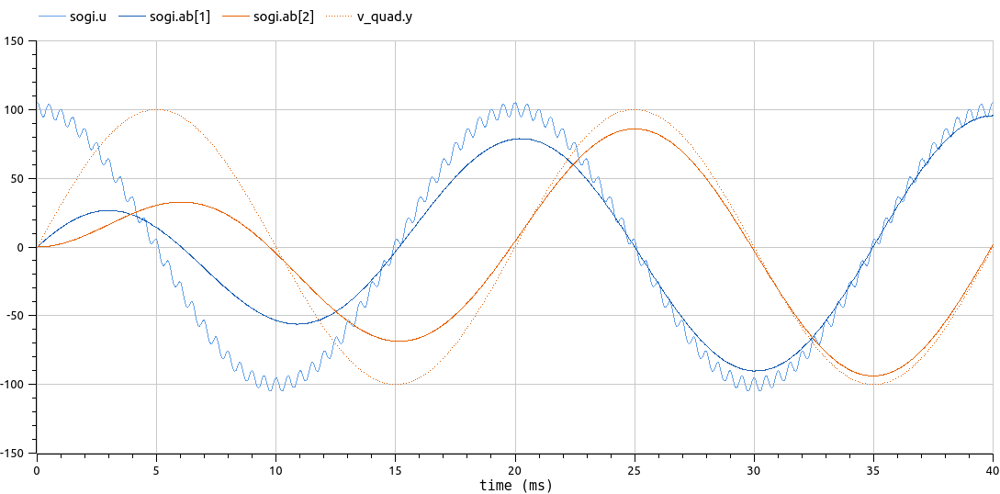

# OwnTech Control library in Modelica

This repository contains a Modelica package, `OwnControl`, to model [OwnTech](https://owntech.io/) C++ [Control library](https://docs.owntech.org/latest/controlLibrary/docs/getting-started/) using block diagrams in Modelica. OwnTech Control library contains signal processing and control classes and functions dedicated for power electronics.

## Usage

Requirements: you need a Modelica simulation environment. 
- `OwnModel` has been developed and tested with [OpenModelica](https://openmodelica.org/) 1.24

1. clone or download (and unzip) this repository
2. open the `OwnControl` package (can be done by double-clicking the `OwnControl/package.mo` file from your file browser)
3. Within your Modelica environment, navigate through the package. You can start with the `Examples/TransformsDemo` model which implements a three-phase signal being transformed to its Clarke αβ and Park dq components

## Package structure

The `OwnControl` package contains the following subpackages:

- **Examples**: demos of filters and control loops that can be directly simulated
- **Filters** blocks, including PLLs (single phase SOGI, three phase SRF)
- **Transforms** blocks: Clarke αβ and Park dq
- **Utilities**: single/three phase signal generators, including harmonics
- **Interfaces** (not needed by model users): [parent](https://mbe.modelica.university/behavior/equations/model_def/#inheritance) abstract/partial model classes that are used to factor out common aspects from sibling components

Finally, the [Resources/Images](OwnControl/Resources/Images) contains some demo simulation records.

## About implementation

The `OwnControl` library reuses interfaces and is compatible with the [Blocks](https://build.openmodelica.org/Documentation/Modelica.Blocks.html) library of the Modelica Standard Library (MSL) version 4.0.0

## Development Status

Early stage:

- Transforms: OK and tested :white_check_mark:
- SOGI filter OK
- PLLs: Single phase SOGI-SRF PLL OK and  tested, Three phase SRF PLL OK
  - :warning: but with differences to the Jan 2025 Hackathon implementation:  SOGI-SRF PLL only works with slower control loop (100 ms instead of 20 ms) and much lower kr (unstable with kr=500 like in the embedded code)

## About the SOGI-QSG filter

(QSG : quadrature signal generator)

See `Examples.SOGIFilterDemo` for a demo of the of SOGI filter ability to:

- **generate Clarke αβ components** from a single phase signal:  α component ≈ sinusoidal input while β component is the same signal lagging by 90°
- **filter out** high frequency noise (and low frequency as well: it is a band-pass filter)

### SOGI filter tuning: kr gain

The SOGI filter is tuned by a `kr` resonance damping gain which should be on the order of 1.0

- small gain implies slow response, but high noise rejection
- high gain implies fast response, but low noise rejection
  - and also, perhaps non intuively, the low noise rejection also means that the filter is slow to reject DC offsets, and indeed the fast startup transient with high kr creates an offset on the β component. With higher kr, this offset is smaller, but takes *longer to vanish!*

